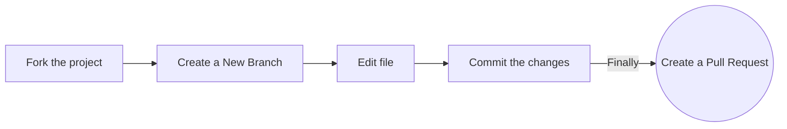

<div align="center">
  <a href="https://www.recodehive.com">
  
  </a>
</div>

<h1 align="center">recode hive</h1>

<div align="center">

[](#contributors)
[](https://github.com/recodehive/recode-website/stargazers)
[](https://github.com/recodehive/recode-website/network/members)
[](https://github.com/recodehive/recode-website/pulls)
[](https://github.com/recodehive/recode-website/issues)
[](https://github.com/recodehive/recode-website/graphs/contributors)
[](https://github.com/recodehive/recode-website/LICENSE)

<h2 align="center">Collaboration 1st , code 2nd.</h2>

**Your all-in-one resource for learning Git, GitHub, Python through comprehensive tutorials and hands-on projects.**

[Website](https://recodehive.com/) • [Documentation](https://recodehive.com/docs) • [Contributing](community/contributing-guidelines.md) • [Discord](https://discord.gg/dh3TA8U55Q)

</div>

---

## 📖 About

recode hive is an open-source educational platform built to help developers master essential technologies through interactive tutorials, practical guides, and community-driven learning. Whether you're a beginner taking your first steps in programming or an advanced developer looking to sharpen your skills, recode hive provides the resources you need.

### Prerequisites

- [Node.js](https://nodejs.org/) ≥ 18
- [Docker](https://docs.docker.com/engine/install/) (optional, for containerized development)
- Docker Compose (optional)

### Installation

**Clone the repository:**

```bash
git clone https://github.com/your-username/recode-website.git
cd recode-website
```

**Using Docker (Recommended):**

```bash
# Build the image (first time only)
docker build -t recodehive-app .

# Run the container
docker run -p 3000:3000 recodehive-app
```

**Using Docker Compose (with hot-reload):**

```bash
docker-compose up
```

Your application will be available at http://localhost:3000

**Traditional Setup:**

```bash
npm install
npm run start
```

### Production Build

```bash
npm run build
npm run serve
```

## 🛠️ Tech Stack

### Core Technologies

- **Framework:** Docusaurus 3 (React + TypeScript)
- **Language:** TypeScript (Node.js ≥ 18)
- **Styling:** Tailwind CSS 4
- **UI Components:** Radix UI, Framer Motion

### Developer Tools

- **Linting & Formatting:** ESLint, Prettier
- **Type Checking:** TypeScript (`tsc`)

## 📁 Project Structure

```
recode-website/
│
├── .github/                    # GitHub configuration
│   ├── ISSUE_TEMPLATE/
│   ├── workflows/
│   └── pull_request_template.md
│
├── blog/                       # Blog posts
│   ├── git-coding-agent/
│   ├── google-backlinks/
│   └── ...
│
├── community/                  # Community documentation
│   ├── contributing-guidelines.md
│   ├── index.md
│   ├── our-documentation.md
│   └── understand-lint-checks.md
│
├── docs/                       # Main documentation
│   ├── GitHub/
│   ├── Google-Student-Ambassador/
│   └── ...
│
├── src/                        # Source code
│   ├── components/             # React components
│   ├── css/
│   │   └── custom.css
│   ├── data/
│   ├── database/
│   ├── lib/
│   ├── pages/
│   ├── plugins/
│   ├── services/
│   ├── style/
│   │   └── globals.css
│   ├── theme/
│   └── utils/
│
├── static/                     # Static assets
│   ├── icons/
│   ├── img/
│   ├── .nojekyll
│   └── *.png
│
├── .gitignore
├── CODE_OF_CONDUCT.md
├── LICENSE
├── README.md
└── ...
```

## 🤝 Contributing

We welcome contributions from developers of all skill levels! Here's how you can get started:

### Contribution Workflow



### Step-by-Step Guide

**Fork the repository** on GitHub

**Clone your fork:**

```bash
git clone https://github.com/your-username/recode-website.git
cd recode-website
```

**Create a new branch:**

```bash
git checkout -b feature/your-feature-name
```

**Make your changes** and test thoroughly

**Commit your changes:**

```bash
git commit -m "Add: brief description of your changes"
```

**Push to your fork:**

```bash
git push origin feature/your-feature-name
```

**Submit a Pull Request** with a detailed description of your changes

### Video Tutorial

<div>
    <a href="https://www.loom.com/share/c8d8d5f0c2534a1f86fc510dcef52ee0">
      <p>How to Contribute to this Repo | How to Setup - Watch Video</p>
    </a>
    <a href="https://www.loom.com/share/c8d8d5f0c2534a1f86fc510dcef52ee0">
      
    </a>
</div>

For detailed guidelines, please refer to our [Contributing Guidelines](community/contributing-guidelines.md).

## 📚 Documentation

- [Contributing Guidelines](community/contributing-guidelines.md)
- [Code of Conduct](CODE_OF_CONDUCT.md)
- [Understanding Lint Checks](community/understand-lint-checks.md)
- [Our Documentation Standards](community/our-documentation.md)

## 💬 Community

Join our community and connect with fellow learners:

[](https://discord.gg/dh3TA8U55Q)
[](https://www.linkedin.com/in/sanjay-k-v/)

## 📊 Project Statistics


## 👥 Contributors

We appreciate all contributions to recode hive! Thank you to everyone who has helped make this project better.

<a href="https://github.com/RecodeHive/recode-website/graphs/contributors">
  
</a>

## ⚖️ License

This project is licensed under the [MIT License](LICENSE). See the LICENSE file for details.

## 📬 Stay Connected

Stay up to date with the latest from recode hive:

- **Website:** [recodehive.com](https://recodehive.com/)
- **Instagram:** [@nomad_brains](https://www.instagram.com/nomad_brains/)
- **LinkedIn:** [Sanjay K V](https://www.linkedin.com/in/sanjay-k-v/)
- **Twitter:** [@sanjay*kv*](https://x.com/sanjay_kv_)
- **YouTube:** [@RecodeHive](https://www.youtube.com/@RecodeHive)
- **Newsletter:** [Subscribe](https://recodehive.substack.com/)

---

<div align="center">

**Happy open-source contributions—here's to your career success! 🎉**

<p align="center">
  
</p>

Made with ❤️ by the recode hive community

<a href="#top">
  
</a>

</div>
