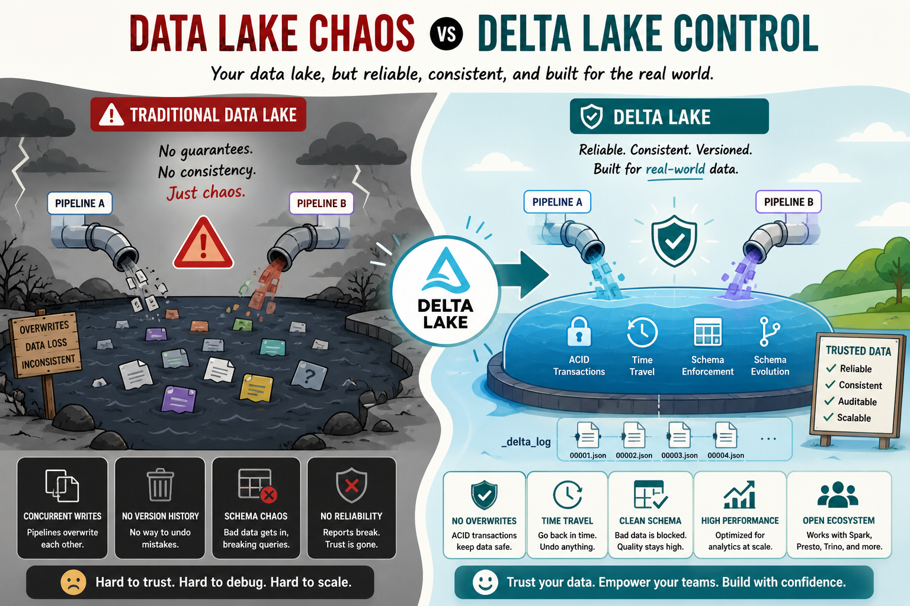

 <!-- truncate -->
## There Is Something Wrong With Your Data Lake

Imagine this: your firm receives hundreds of records per hour, be it users signing up for an account, making purchases, or using your mobile application. You store all these records in a data lake, which is hosted on the cloud. Got it?

Now, imagine something happening to this system. Two pipelines write to the same table simultaneously, overwriting each other. And now half of your data is gone. No one notices until it becomes obvious in the weekly report.

The issue described above is a common one when using traditional data lakes. The thing is that data lakes were created to solve a different problem, one of storing information rather than ensuring its reliability.
And that's what **Delta Lake** is designed to solve.




## What is Delta Lake, in Plain English?

Consider a traditional data lake to be a folder in Google Drive, where anyone has the ability to edit or even delete anything inside without leaving an audit trail or version history.
What if that folder was:

- 1. Version-controlled and could be rolled back to any previous state
- 2. Guaranteed to have a clean schema
- 3. Structured such that bad data can't possibly get stored
- 4. Secure against race conditions when used by multiple writers

This folder would be a Delta Lake. It operates over the storage already provided for your organization and makes all those promises without asking you to move off your storage infrastructure.


## The Four Unique Features of Delta Lake

### 1. ACID Transactions: Corruption-Free Data!

ACID Transactions are `Atomicity`, `Consistency`, `Isolation`, and `Durability`. It is not mandatory to memorize these terminologies, but it is essential to understand how they operate.
Delta Lake provides us a guarantee that when two processes attempt to modify the same dataset, none of them will overwrite the other's modification. Each process either proceeds or waits for their turn, which gives us consistency in our data like a queue at the cashier.

### 2. Time Travel: The "Undo" Feature

When working with a Delta table, all of your operations are kept in versioning. Accidentally deleted a record? Performed a bad update operation? With the time travel feature, we can revert changes and query the data at any point in time in history of our table.

### 3. Schema Enforcement: Bad Data Rejection
Suppose that your schema requires a certain field to only contain numerical values while another client attempts to send you a record that contains a string. In this case, Delta Lake blocks this row from being entered into the dataset.

### 4. Schema Evolution – Evolving without Breaking Anything

As your product matures, so does your data. Want to add an extra column? Delta Lake makes schema evolution easy – your data remains untouched while your workflows continue uninterrupted.

## And How Exactly Does That Work?

All the magic above happens because of a mechanism known as the Transaction Log, and it’s kept in a folder named `_delta_log` within your table itself.
Every individual action, be it inserting, deleting, or updating records,  is logged in a JSON format within that log. Delta Lake relies on this transaction log to keep track of the latest status of your table, and which older files can be safely deleted from the system.

## Here’s how your table appears on the disk:

```python
my_table/
├── _delta_log/
│   ├── 00000000000000000000.json   ← "Table was created"
│   ├── 00000000000000000001.json   ← "10 rows were added"
│   └── 00000000000000000002.json   ← "Salary column was updated"
├── part-00001.parquet
├── part-00002.parquet
└── part-00003.parquet
```
The real data is stored in Parquet files, which are highly efficient in terms of querying. The transaction log is the brain, and the Parquet files are the data store..

## Let's Write Some Code

### Setting Up
```Python
pip install delta-spark pyspark
from pyspark.sql import SparkSession
from delta import configure_spark_with_delta_pip

builder = SparkSession.builder \
    .appName("MyFirstDeltaTable") \
    .config("spark.sql.extensions", "io.delta.sql.DeltaSparkSessionExtension") \
    .config("spark.sql.catalog.spark_catalog", "org.apache.spark.sql.delta.catalog.DeltaCatalog")

spark = configure_spark_with_delta_pip(builder).getOrCreate()
```
### Creating a Delta Table
```python
# Let's create a simple employee dataset
employees = [
    (1, "Priya Sharma", "Engineering", 82000),
    (2, "Liam O'Brien", "Marketing", 67000),
    (3, "Yuki Tanaka", "Engineering", 91000),
    (4, "Carlos Mendez", "Sales", 74000),
]
columns = ["id", "name", "department", "salary"]

df = spark.createDataFrame(employees, columns)

# Save it as a Delta table
df.write.format("delta").mode("overwrite").save("/data/employees")
```

That's it. You now have a Delta table with a transaction log, version history, and all the reliability features built in automatically.

### Reading It Back
```python
df = spark.read.format("delta").load("/data/employees")
df.show()
```
```text
+---+-------------+------------+------+
| id|         name|  department|salary|
+---+-------------+------------+------+
|  1| Priya Sharma| Engineering| 82000|
|  2| Liam O'Brien|   Marketing| 67000|
|  3|  Yuki Tanaka| Engineering| 91000|
|  4|Carlos Mendez|       Sales| 74000|
+---+-------------+------------+------+
```

### Using Time Travel

Let's say you update some salaries, then realize the update was wrong:

```python
from delta.tables import DeltaTable

delta_table = DeltaTable.forPath(spark, "/data/employees")

# Give everyone in Engineering a raise
delta_table.update(
    condition="department = 'Engineering'",
    set={"salary": "salary + 5000"}
)
```
Oops!  turns out that update was wrong. No panic. Just travel back to version 0:

```python
# Check the history first
delta_table.history().show()

# Read the original data before the update
original_df = spark.read \
    .format("delta") \
    .option("versionAsOf", 0) \
    .load("/data/employees")

original_df.show()
```

You get your original data back, untouched. You can restore it, compare it, or just use it to figure out what went wrong.


### Inserting and Updating at the Same Time (MERGE)

One of the most useful everyday operations is `MERGE`, often called an upsert. 
It means: update the record if it exists, insert it if it doesn't.

```python
# Some incoming data -- one update, one brand new employee
incoming = [
    (2, "Liam O'Brien", "Marketing", 71000),  # salary updated
    (5, "Amara Osei", "HR", 69000),            # new employee
]

incoming_df = spark.createDataFrame(incoming, columns)

delta_table.alias("existing").merge(
    incoming_df.alias("new"),
    "existing.id = new.id"
).whenMatchedUpdate(set={
    "salary": "new.salary"
}).whenNotMatchedInsert(values={
    "id":         "new.id",
    "name":       "new.name",
    "department": "new.department",
    "salary":     "new.salary"
}).execute()
```
One operation. No duplicates. No manual checking. Clean results every time.

### Keeping Your Table Healthy

Over time, Delta Lake accumulates old data files for time travel. You'll want to periodically clean those up:

```python
# Remove files older than 7 days
spark.sql("VACUUM delta.`/data/employees` RETAIN 168 HOURS")

And if your table gets many small files over time (which slows down queries), compact them:
python
# Compact small files into larger, more efficient ones
spark.sql("OPTIMIZE delta.`/data/employees`")
```

Think of `VACUUM` as taking out the trash and `OPTIMIZE` as reorganizing your desk. Both are good habits to run on a schedule.

## When Should You Utilize Delta Lake?

Delta Lake is perfect for use when:

- 1. There are several pipelines or multiple parties writing to the same data set.
- 2. An audit history of all changes is necessary.
- 3. The schema of your data can change.
- 4. You would like to detect any data that could cause problems.
- 5. Real-time streams and batch historical data are being combined.

If you have static files that are never going to be changed, then regular Parquet will be sufficient. However, the second your data becomes dynamic, it's worth its weight in gold.

## Conclusion

In essence, Delta Lake starts with taking the idea of a data lake – low-cost, scalable, and flexible storage – and makes it reliable. The ACID transaction model eliminates silent corruptions, time travel allows you to get back your data on any mistake, while schema enforcement prevents bad data from entering your system, while at the same time schema evolution makes sure your data stack evolves easily.

And at the heart of this system lies nothing else but a transaction log – an easy and audit-ready record of every transaction made to your data.

When it comes to building data pipelines where data quality really matters – which happens sooner or later – Delta Lake cannot be anything else but the base of your stack. But most importantly, it’s very easy to implement.


<GiscusComments/>