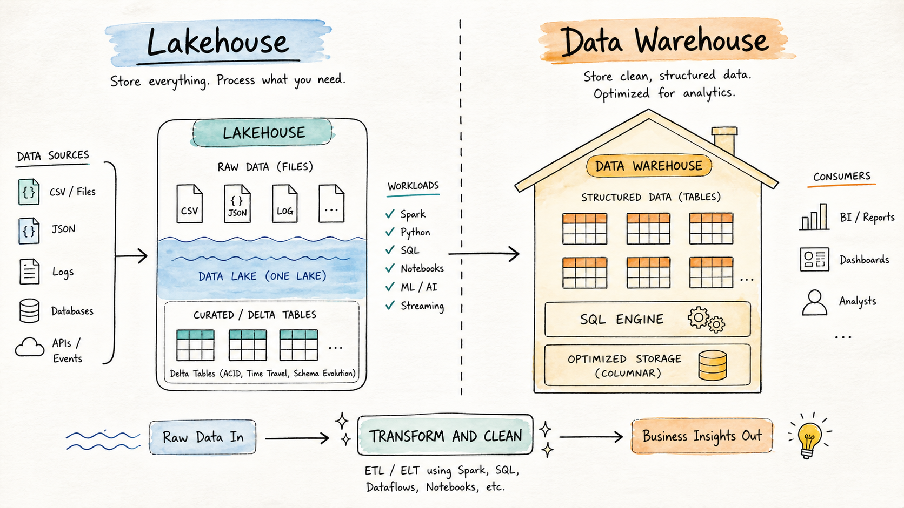

<!-- truncate -->

# Lakehouse vs Data Warehouse: What's the Difference and When to Use Each

If you've spent any time in the modern data space, you've almost certainly heard both terms, often in the same breath, and often used interchangeably. But a Lakehouse and a Data Warehouse are not the same thing, and confusing the two leads to architectural decisions that are difficult to undo later.

This article breaks down what each architecture actually is, how they differ, and when to reach for each one, without the platform bias.

## What Is a Data Warehouse?

The Data Warehouse has been the backbone of business intelligence for decades. The core idea is simple: take cleaned, structured data, store it in a highly optimized format, and make it fast and reliable to query with SQL.

A warehouse enforces a predefined schema, meaning data must conform to a defined structure before it can be loaded. This strictness is a feature, not a limitation. It ensures that the data analysts and business users query is consistent, governed, and trustworthy.

Key characteristics:

- 1. Designed for structured, cleaned, analytics-ready data
- 2. Strict schema enforcement (schema-on-write)
- 3. Highly optimized for SQL-based analytical queries
- 4. Strong governance, security, and access controls
- 5. Primary consumers are SQL analysts, BI teams, and business stakeholders

Platforms like **Snowflake**, **Google BigQuery**, **Amazon Redshift**, and **Azure Synapse** are well-known implementations of the data warehouse model. They excel when your data is already clean and your consumers need fast, reliable SQL access.

## What Is a Lakehouse?

The Lakehouse is a newer architectural pattern that emerged to solve a specific problem: traditional data lakes were great at storing everything cheaply, but terrible at making that data reliably queryable.

Data lakes stored raw files (CSVs, JSON, Parquet, logs, images) in object storage like S3 or ADLS. Flexible and cheap, yes. But without structure or governance, they quickly became "data swamps" where data existed but nobody trusted it.

The Lakehouse fixes this by adding a structured table layer using open formats like **Delta Lake**, **Apache Iceberg**, or **Apache Hudi**, directly on top of object storage. You get the cost efficiency and flexibility of a data lake, combined with ACID transactions, schema enforcement, time travel, and reliable SQL access.

Key characteristics:

- 1. Stores raw, semi-structured, and structured data in a single system
- 2. Uses open table formats (Delta Lake, Iceberg, Hudi)
- 3. Supports multiple processing engines like Spark, Python, and SQL
- 4. Schema can evolve over time as data needs change
- 5. Supports both engineering pipelines and ML workflows from the same storage layer

Platforms like **Databricks**, **Apache Spark on cloud object storage**, and other modern data platforms implement the Lakehouse pattern. It is particularly well suited for teams that need to support both data engineering and data science workloads on the same data.

---

## Key Differences at a Glance

| Aspect | Lakehouse | Data Warehouse |
|---|---|---|
| **Data Type** | Raw, semi-structured, and structured | Structured only |
| **Schema Approach** | Schema-on-read or evolving | Schema-on-write, strict |
| **Flexibility** | High | Moderate |
| **Processing Engines** | Spark, Python, SQL | Primarily SQL |
| **Primary Users** | Data Engineers, Data Scientists | Analysts, BI teams |
| **Primary Use Cases** | Ingestion, transformation, ML | Reporting, dashboards, ad-hoc analytics |
| **Governance Maturity** | Developing | Mature, well-established |
| **Storage Cost** | Lower (object storage) | Higher (optimized proprietary storage) |

## When to Use a Lakehouse

A Lakehouse is the right choice when your workload involves data in its earlier, messier stages, before it has been fully cleaned and structured for reporting.

Use a Lakehouse when:

- 1. You are ingesting raw or semi-structured data from external sources like APIs, event streams, IoT devices, or application logs
- 2. You need to run transformation and cleaning pipelines before data is analytics-ready
- 3. Your team works primarily in Spark or Python
- 4. Your schema changes frequently as business or source systems evolve
- 5. You are building machine learning features, training datasets, or experimental models
- 6. You need a cost-efficient store for large volumes of data at various stages of processing

Think of the Lakehouse as the engineering zone, where data arrives in its raw form, gets processed, and gets shaped into something reliable and usable.

## When to Use a Data Warehouse

A Data Warehouse is the right choice when your data is already clean, structured, and needs to support fast, reliable analytics for business users.

Use a Data Warehouse when:

- 1. Data has already been transformed and is ready for consumption
- 2. Your consumers are SQL analysts or BI teams using tools like Tableau, Looker, or Power BI
- 3. You need fast, predictable query performance on large structured datasets
- 5. Governance, row-level security, and access controls are critical requirements
- 6. You are supporting stable, recurring reporting and dashboards that business decisions depend on

Think of the Data Warehouse as the consumption zone, where curated, trusted data is exposed to the people who need to make decisions from it.

## How They Work Together

Here is the thing that often gets lost in this debate: in most real-world architectures, you use both.

Lakehouse and Data Warehouse are not alternatives. They serve different stages of the same data lifecycle. A typical flow looks like this:

- 1. Raw data lands in the Lakehouse, from pipelines, event streams, or batch loads
- 2. Data Engineers transform and clean it using Spark notebooks, dbt, or other transformation tools
- 3. Curated, structured datasets are loaded into the Data Warehouse where SQL analysts can query them reliably
- 4. BI tools connect to the Warehouse for dashboards, reports, and business consumption

The Lakehouse handles the complexity of early-stage data. The Warehouse handles the reliability of late-stage consumption. Each does what it is best at, and together they cover the full data lifecycle.

## Choosing Between Them

If you are still unsure which to reach for, here is a simple way to think about it. Ask yourself who is consuming this data and in what state it needs to be.

- 1. If the consumer is a data engineer or data scientist working with raw or intermediate data, go with a Lakehouse
- 2. If the consumer is an analyst or business user needing clean, structured data for reporting, go with a Data Warehouse
- 3. If you have both types of consumers (and most teams do), use both in sequence

The workload determines the architecture. Not preference, not trend, not what a vendor is currently marketing.

## Conclusion

Lakehouse and Data Warehouse represent two different philosophies about how data should be stored and accessed, and both are right, just at different stages of the pipeline.

The Lakehouse gives you flexibility, scale, and support for diverse workloads across engineering and data science. The Data Warehouse gives you structure, query performance, and the governance that business reporting demands.

Understanding the distinction is not just academic. It directly affects how you design your pipelines, how you structure your teams, and how reliably data reaches the people who depend on it. The best architectures don't choose between them. They use each where it belongs.

*Building a data platform and figuring out where each piece fits? Let's talk.*

🔗 [LinkedIn](https://www.linkedin.com/in/aditya-singh-rathore0017/) | [GitHub](https://github.com/Adez017)

<GiscusComments/>