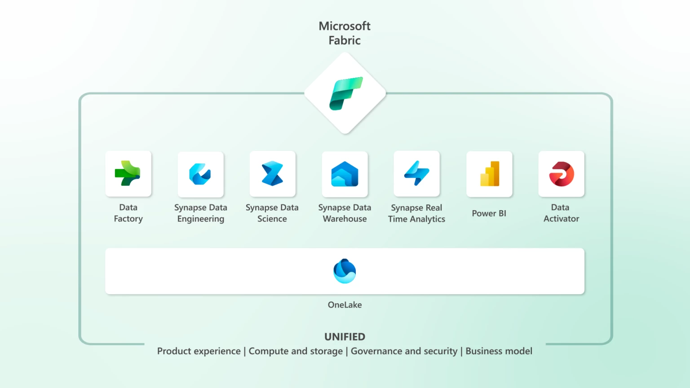
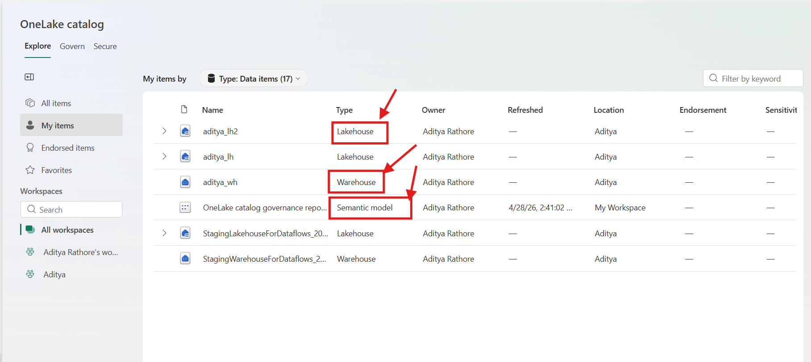
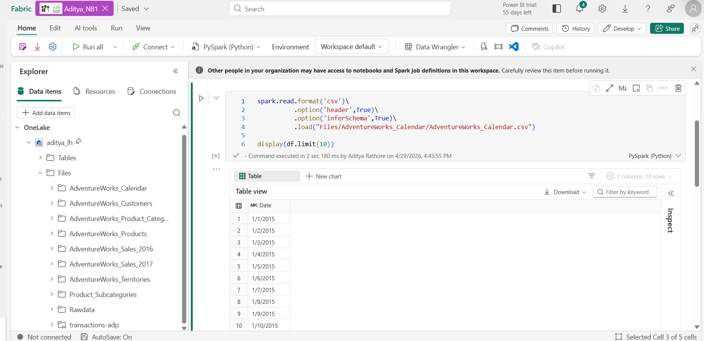
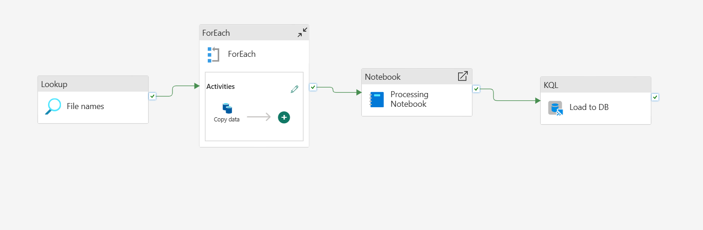
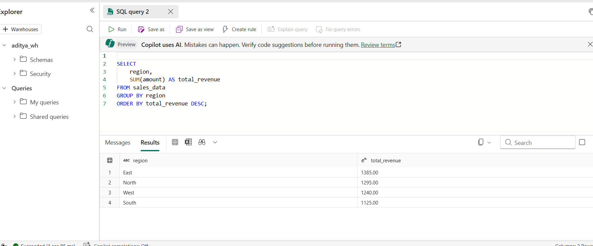
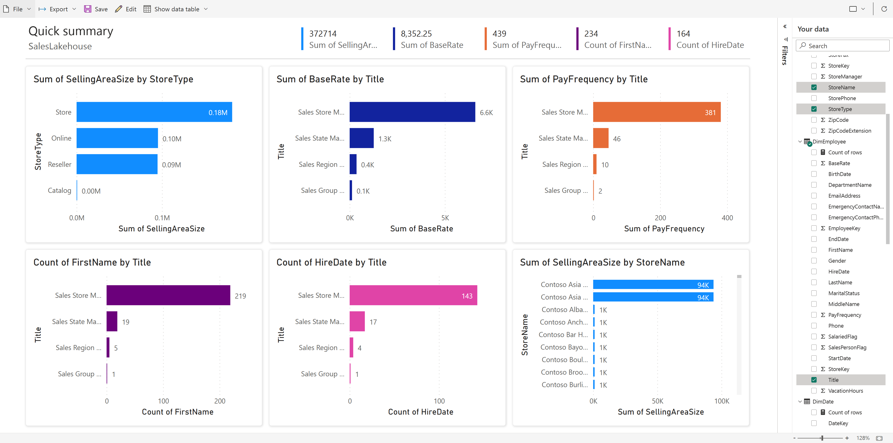

<!-- truncate -->
# Microsoft Fabric: One Platform, One Lake, Every Data Workload

Modern data teams don't struggle because of a lack of tools - they struggle because of too many.

A typical data stack today might include a cloud data warehouse, an object store, a managed Spark environment, a pipeline orchestration tool, and a BI layer on top. Each powerful on its own. But getting them to work together, moving data across systems, keeping governance consistent, debugging failures across layers often becomes a bigger challenge than the actual data work itself.

I ran into this exact problem while building pipelines across Azure Data Factory, ADLS Gen2, and Synapse. Every hand-off between tools meant another connection to configure, another permission to grant, another place for something to silently break.

Microsoft Fabric takes a different approach, instead of adding another tool to the stack, it brings everything together into a single unified platform. Here's how it actually works.

---

## The Foundation: OneLake

Every component in Fabric is built on top of **OneLake**, the platform's unified, logical data lake and the single source of truth for your entire Fabric workspace.

Every workload, whether it's a Spark notebook, a SQL warehouse query, a Power BI report, or an ML experiment, reads from and writes to the same underlying storage. No data movement between services. No export-and-reload step when a data scientist needs access to a table a data engineer just built.

OneLake stores everything in **Delta Parquet format**, an open-source table format that supports ACID transactions, schema enforcement, time travel, and versioning. This matters: your data is not locked into a proprietary format. It's readable by Spark, DuckDB, Pandas, Polars, and most modern query engines outside of Fabric too.

> 📖 Read more: [What is OneLake?](https://learn.microsoft.com/en-us/fabric/onelake/onelake-overview)

The first time I opened OneLake in my Fabric workspace, what struck me was how everything just *appeared*, my Lakehouse tables, my warehouse tables, all visible in one file explorer without any registration or sync step. That's when the "one lake" concept clicked for me practically, not just conceptually.

*📸 Screenshot: OneLake file explorer from my Fabric workspace — Lakehouse and Warehouse tables visible side by side*

---

## Data Engineering: Lakehouses, Spark, and Notebooks

Fabric's data engineering experience is organized around the **Lakehouse** — a storage construct that combines the flexibility of a data lake with the query capabilities of a data warehouse.

When you create a Lakehouse, you get a two-zone structure:

- A **Files area** for raw, unstructured, or semi-structured data (CSV, JSON, images, logs)
- A **Tables area** where data is stored as managed Delta tables, immediately queryable by SQL, Spark, and Power BI

For transformation workloads, Fabric provides a fully managed **Apache Spark** environment. You write notebooks in Python, Scala, SQL, or R. Clusters are serverless by default — they start on demand, require no configuration, and shut down automatically when idle.

> 📖 Read more: [Apache Spark in Microsoft Fabric](https://learn.microsoft.com/en-us/fabric/data-engineering/spark-overview)

*📸 Screenshot: A Spark notebook from my Fabric workspace — reading raw CSV from the Files zone, writing a clean Delta table to Tables*

Coming from standalone Databricks, the Spark notebook experience in Fabric felt noticeably lighter to set up. No cluster configuration, no runtime version juggling, you open a notebook and it just works.

For production workloads, you can promote notebooks to **Spark Job Definitions** for scheduled execution, and manage library dependencies using **Environments**, versioned, shareable Spark configurations that eliminate the classic "works on my cluster" problem.

> 📖 Read more: [Fabric Lakehouse overview](https://learn.microsoft.com/en-us/fabric/data-engineering/lakehouse-overview)

## Data Ingestion and Orchestration: Data Factory

Getting data from external systems into the Lakehouse is the job of **Data Factory**, Fabric's data integration and orchestration layer.

Data Factory offers two primary patterns:

**Pipelines** - The activity-based orchestration tool, familiar to anyone who has used Azure Data Factory or Apache Airflow. You build directed acyclic graphs of copy activities, transformation steps, conditional logic, and triggers. Fabric pipelines support hundreds of connectors to external databases, REST APIs, cloud storage, and SaaS applications.

**Dataflows Gen2** - A code-free alternative using a visual, Power Query-based interface. Transformations compile to Spark or SQL execution under the hood, a practical option for analysts who need to express transformation logic without writing code.

*📸 Screenshot: A pipeline from my Fabric workspace ingesting from a REST API into the Lakehouse — configured entirely within Fabric, no external ADF instance needed*

One thing I genuinely appreciated: neither pipelines nor dataflows require a separate connection configuration to reach your Lakehouse because it's already in the same workspace. You select it from a dropdown. Small thing, big time saver when you're building pipelines daily.

## SQL Analytics: The Data Warehouse

Fabric's **Data Warehouse** is a fully managed T-SQL analytics engine, but with an important architectural distinction. It stores its data in Delta Parquet on OneLake, not in a proprietary internal format.

This means tables written by your Spark notebooks in the Lakehouse are directly readable by warehouse SQL queries and warehouse tables are readable by Spark without any copy or ETL step in between.

**A practical decision guide:**

| Use the Lakehouse when... | Use the Warehouse when... |
|---|---|
| Workloads are Spark-heavy | Consumers are SQL analysts |
| Data is schema-flexible | Structured, governed tables are needed |
| Programmatic transformation logic is required | Strong query performance with SQL semantics is the priority |

*📸 Screenshot: Querying a Lakehouse Delta table directly from the Fabric Warehouse SQL editor — no data copy needed*

## Real-Time Intelligence: Streaming and Event Data

**Real-Time Intelligence** is Fabric's answer to streaming workloads and one of the more complete streaming experiences available within a unified platform.

**Eventstreams** act as a managed event streaming layer. You connect to sources like Azure Event Hubs, Kafka, or IoT Hub, apply in-flight transformations using a visual stream-processing editor, and route output to multiple destinations simultaneously.

The destination for high-frequency event data is typically an **Eventhouse**, which contains one or more **KQL databases**. KQL (Kusto Query Language) is optimized for time-series and log data significantly faster than SQL for streaming analytics queries like "show me anomalies in sensor readings in the last 15 minutes, grouped by device."

Crucially, Eventhouse data also lives in OneLake meaning historical event data can be joined with batch data from the Lakehouse or Warehouse without a separate data movement step.

> 📖 Read more: [Real-Time Intelligence in Microsoft Fabric](https://learn.microsoft.com/en-us/fabric/real-time-intelligence/overview)

## Data Science and Machine Learning

Fabric's **Data Science** experience covers the full ML lifecycle — from exploratory analysis through model training, evaluation, and deployment.

The primary workspace is Jupyter-style notebooks backed by managed Spark, with access to the full Python ML ecosystem (scikit-learn, XGBoost, PyTorch, TensorFlow) and **SynapseML** for distributed ML on Spark.

Fabric integrates **MLflow** natively for experiment tracking and model registration. Models can be used for batch scoring directly against Lakehouse tables using the `PREDICT` function in Spark SQL — no separate serving infrastructure required for batch inference.

The deeper value: feature tables built by data engineers in the Lakehouse are immediately accessible in ML notebooks without copying or re-ingesting data. The gap between data engineering and data science shrinks considerably when both are working against the same underlying tables.

> 📖 Read more: [Data Science in Microsoft Fabric](https://learn.microsoft.com/en-us/fabric/data-science/data-science-overview)

## Security and Governance: Built In

One of the more understated strengths of Fabric's unified architecture is what it enables for governance. When all your data lives in one place, you define access policies once — not once per service.

Fabric integrates with **Microsoft Entra ID** for identity and access management, and with **Microsoft Purview** for data cataloging, lineage tracking, and sensitivity labeling. Row-level security, column-level security, and workspace-level access controls are applied uniformly across all Fabric experiences.

A sensitivity label applied to a table in the Lakehouse is respected when that same table is queried from the Warehouse or visualized in Power BI, a significant operational advantage over managing access policies across a fragmented stack.

---

## Power BI: Reporting Without Data Duplication

Power BI is the reporting layer and in Fabric, it gains **DirectLake mode**, which addresses one of its longest-standing pain points.

Traditionally, Power BI reports could either:
- Query live data (slow, puts load on source systems), or
- Import data into an in-memory model (fast, but creates a stale copy requiring scheduled refreshes)

DirectLake is a third mode - it reads directly from Delta Parquet files in OneLake at query time, delivering import-speed performance without maintaining a separate copy of the data.

For data engineers, this changes everything. Once your pipeline writes a clean Delta table to the Lakehouse, a Power BI report can query it in DirectLake mode immediately, no refresh schedule, no import process, no synchronization lag.

*📸 Screenshot: A Power BI report in DirectLake mode querying my Fabric Lakehouse — always current as of the last pipeline run*

---

## Bringing It All Together

The reason Fabric is worth serious evaluation is not any individual component — it's what the unified architecture enables across all of them.

A pipeline in Data Factory writes to a Lakehouse → A Spark notebook transforms it into a clean Delta table → A data scientist trains a model against that table → A warehouse analyst queries it in SQL → A Power BI report visualizes it in DirectLake mode → An Eventstream feeds real-time data into the same Lakehouse alongside batch data. Throughout all of this, Purview tracks lineage and Entra enforces access policies.

None of these steps require a separate connector, a data copy, or a cross-service authentication configuration. They are all reading from OneLake.

For teams that have spent years managing the operational overhead of a fragmented data stack, that's a genuinely meaningful shift, one where the platform handles the integration, and engineers can focus on the work that actually matters.

---

## Try It Yourself

- **Microsoft Fabric Free Trial** → [app.fabric.microsoft.com](https://app.fabric.microsoft.com/)
- **Full Documentation** → [learn.microsoft.com/fabric](https://learn.microsoft.com/fabric)
- **OneLake Documentation** → [What is OneLake?](https://learn.microsoft.com/en-us/fabric/onelake/onelake-overview)
- **Apache Spark in Fabric** → [Spark overview](https://learn.microsoft.com/en-us/fabric/data-engineering/spark-overview)
- **Real-Time Intelligence** → [RTI overview](https://learn.microsoft.com/en-us/fabric/real-time-intelligence/overview)
- **Data Science in Fabric** → [Data Science overview](https://learn.microsoft.com/en-us/fabric/data-science/data-science-overview)

## About the Author

I'm **Aditya Singh Rathore**, a Data Engineer passionate about building modern, scalable data platforms. I write about Microsoft Fabric, Azure data tools, and real-world data engineering on [RecodeHive](https://www.recodehive.com/),breaking down complex concepts into practical, actionable content.

If this article helped you understand Microsoft Fabric better, consider sharing it with your network. And if you're building something with Fabric or just getting started, I'd love to hear about it.

🔗 Connect with me on [LinkedIn](https://www.linkedin.com/in/aditya-singh-rathore0017/) | [GitHub](https://github.com/Adez017)

📩 Have a topic you'd like me to cover? Drop it in the comments below.

<GiscusComments/>