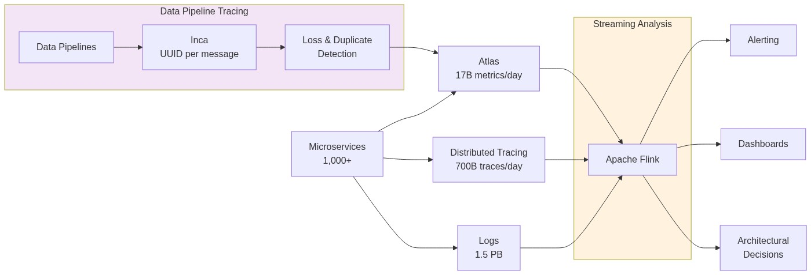
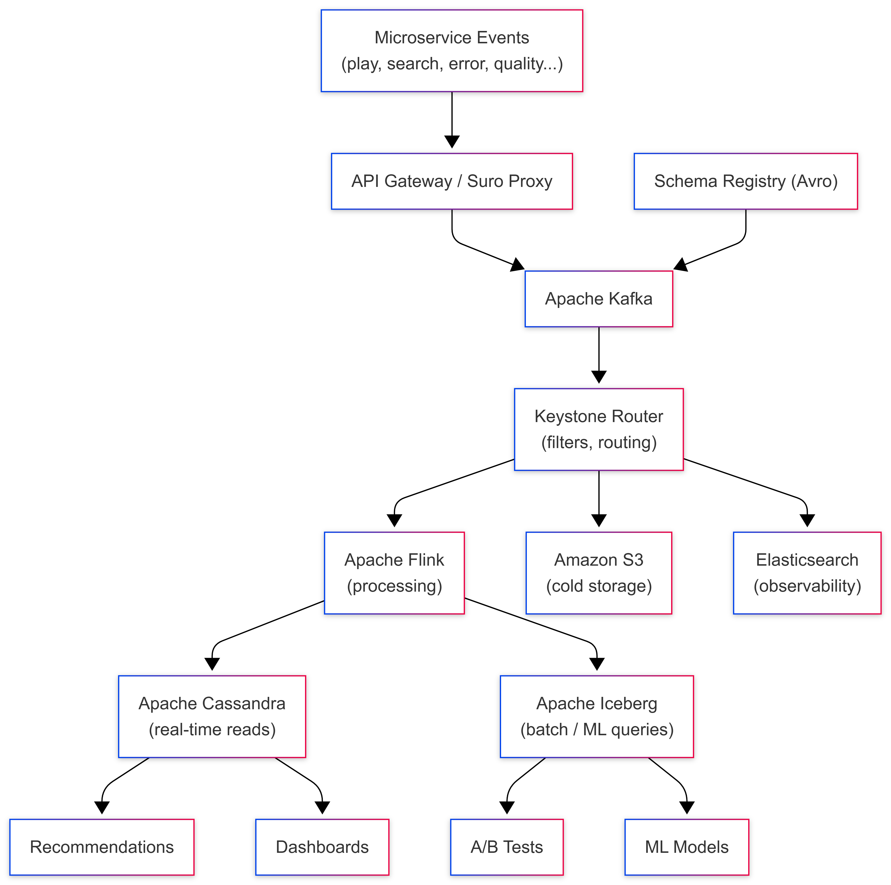
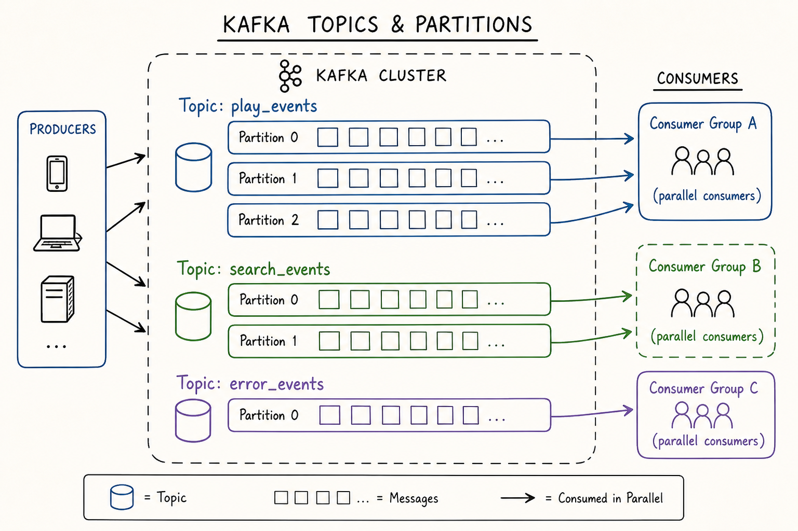
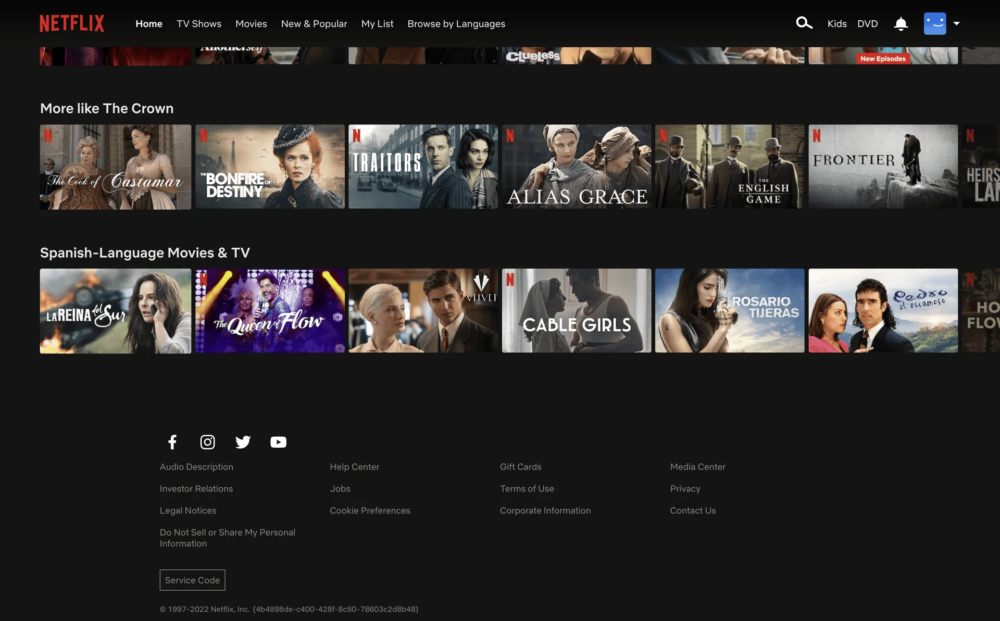

<!-- truncate -->

# How Netflix Handles 2 Trillion Events Every Day

Right now, someone is pausing Stranger Things at the exact moment a jump scare hits.

Someone else just searched "action movies" and clicked the third result. Another person skipped the intro of a show they've watched five times. And somewhere, a user on a slow connection just had their video quality automatically drop from 4K to 1080p, without any buffering, without any prompt.

Every single one of these actions is an **event**. And Netflix captures all of them from 300 million subscribers across 190 countries, continuously, in real time.

The scale: **2 trillion events every single day.** That's 3 petabytes of data ingested, 7 petabytes output, at a peak rate of 12.5 million events per second. The system behind all of this is called **Keystone** - Netflix's internal real-time data pipeline, and understanding how it works is one of the most instructive case studies in modern data engineering.


## The Scale Problem: Why This Is Actually Hard

Most people assume Netflix's hard problem is streaming video. It's not. The hard problem is streaming *data about* video.

Every time you interact with Netflix, dozens of microservices each emit their own events simultaneously. A single "press play" triggers events from the playback service, the recommendation service, the quality-monitoring service, the CDN routing service, and more, all at the same time. Now multiply that by 300 million concurrent users across different time zones.

Before Keystone, Netflix ran a batch pipeline built on Chukwa, Hadoop, and Hive. By 2015, logging volume had grown to 500 billion events per day and the system was collapsing. Netflix estimated they had **six months** to rebuild it as a streaming-first architecture before it failed completely under subscriber growth.

That pressure is why every architectural decision in Keystone was made under real production constraints not theoretical design.


*Keystone processes 2 trillion events/day — 3PB ingested, 7PB output daily. Source: Netflix Engineering*


## What Is an Event, Exactly?

An event is a small structured record, typically a few kilobytes that captures a single thing that happened. Every event at Netflix carries a consistent set of core fields:

```json
{
  "event_id":   "uuid-1234-abcd",
  "event_type": "play_start",
  "user_id":    "u_98765432",
  "device_id":  "d_iPhone15",
  "title_id":   "t_StrangerThings_S4E1",
  "timestamp":  "2026-05-04T18:32:11.452Z",
  "session_id": "s_abc123",
  "region":     "IN",
  "quality":    "1080p",
  "network":    "WiFi"
}
```

Netflix generates hundreds of distinct event types across all its services:

- `play_start`, `play_pause`, `play_stop`, `seek`
- `search_query`, `search_result_click`
- `scroll_position`, `title_hovered`, `row_impression`
- `buffer_start`, `buffer_end`, `quality_change`
- `error_occurred`, `playback_failed`
- `ab_test_assignment`, `recommendation_shown`

Each event type has its own schema, its own set of required and optional fields, data types, and validation rules. Managing thousands of schemas across hundreds of microservice teams is itself a major engineering problem. That's exactly what the Schema Registry (covered below) was built to solve.

The event above looks simple. But when you're ingesting 12.5 million of them every second, the engineering required to make that reliable without data loss, without duplicates, without schema corruption is anything but simple.


## The Architecture: Keystone, Kafka, and Flink

Before diving into individual tools, watch this first. Flink Forward's breakdown gives you the visual mental model that makes the rest of this article click into place:

<iframe
  width="100%"
  height="400"
  src="https://www.youtube.com/embed/lC0d3gAPXaI"
  title="Netflix Data Engineering with Apache Flink"
  frameborder="0"
  allowfullscreen>
</iframe>

---

### Keystone: The Platform That Wraps Everything

Most articles jump straight to Kafka and Flink. But the important thing to understand first is **Keystone :** the internal platform that manages the entire pipeline as a service.

Keystone is not a single open-source tool. It's Netflix's purpose-built **Stream Processing as a Service (SPaaS)** platform built on top of Kafka and Flink. It provides:

- A **Data Pipeline layer**: handles event ingestion, routing, and delivery to all downstream sinks (S3, Elasticsearch, secondary Kafka topics)
- A **Stream Processing layer**: lets any Netflix engineering team deploy and run custom Flink jobs without managing the underlying infrastructure themselves
- A **Control Plane**: manages job configuration, deployment via Spinnaker, health monitoring, and self-healing. Every job's desired state is stored in AWS RDS, if a Kafka cluster goes down, it can be fully reconstructed from RDS alone

Think of Keystone as the operating system for data at Netflix. Kafka and Flink are the engines. Keystone is the layer that makes them usable, self-service, and reliable across thousands of internal teams.

> 📖 [Keystone Real-time Stream Processing Platform — Netflix Tech Blog](https://netflixtechblog.com/keystone-real-time-stream-processing-platform-a3ee651812a)

The full pipeline architecture:



---

### Layer 1: Event Capture: Suro and the API Gateway

When a Netflix microservice emits an event, it has two paths into Kafka:

1. **Direct Kafka write** via a Java client library, for high-throughput services that need maximum speed
2. **HTTP POST via Suro :**  Netflix's internal event collection proxy for services in Python or other languages

Both paths end at the same place: a Kafka topic. The critical design principle here is **capture first, process never at the entry point.** The gateway does minimal validation, is the schema registered? does the payload match? and then writes immediately. No enrichment, no business logic, no database calls.

At 12.5 million events per second, even a 1-millisecond database call per event would require 12,500 concurrent database operations per second at the gateway alone. Keeping the entry point stateless is what makes the pipeline scale.


### Layer 2: Apache Kafka: The Heart of the Pipeline

[Apache Kafka](https://kafka.apache.org/) is the backbone of Keystone. Every event from every microservice flows through Kafka before going anywhere else.

**Topic-per-event-type architecture:**

Netflix follows a strict rule: *one Kafka topic per event type.* Hundreds of topics run in parallel — `play_events`, `search_events`, `error_events`, `quality_events`, and so on. This isolation means a spike in error events during an outage doesn't slow down play event processing, and each topic can have its own retention policy, replication factor, and partition count independently tuned.

**Durability profiles:**

Netflix configures Kafka with different durability levels depending on how critical the data is. For AP (Availability over Consistency) use cases - analytics events where losing a tiny fraction is acceptable, they allow unclean leader election, trading perfect consistency for never going down. For CP (Consistency over Availability) use cases - billing events, legal audit logs, they require clean leader election with no data loss possible.

**Avro + Schema Registry - the data contract:**

Every event in Kafka is encoded in **Apache Avro**, a compact binary format that is 3-5x smaller than JSON and significantly faster to parse. But more importantly, every Avro schema is registered in a centralised **Schema Registry** before any event can be written.

When a team deploys a bad change that sends a malformed event - wrong field type, missing required field, Kafka rejects it at the producer. It never enters the pipeline. At 2 trillion events per day, an undetected schema mismatch could corrupt petabytes of downstream data before anyone notices. Schema enforcement at the source is what prevents this.

> 📖 [How Netflix Uses Kafka for Distributed Streaming — Confluent](https://www.confluent.io/blog/how-kafka-is-used-by-netflix/)


*Kafka organises events into topics with partitions — parallel consumption by multiple downstream systems simultaneously. Source: Conduktor*

**Retention and replay:**

Kafka doesn't store events forever. Netflix sets retention policies per topic, high-volume topics might retain data for hours, lower-volume ones for days. The safety net: all Kafka records are also persisted to **Apache Iceberg** tables on S3. If a downstream Flink job fails and needs to reprocess events that have already expired from Kafka, it reads from Iceberg instead. The pipeline is fully replayable.


### Layer 3 - Apache Flink: Where Raw Events Become Useful Data

Kafka stores and delivers events reliably. But events in a queue don't power recommendations or dashboards. They need to be processed and that's [Apache Flink](https://flink.apache.org/)'s job.

Flink jobs run continuously, 24/7, consuming from Kafka topics in near real time. A typical Flink job in Keystone runs this chain of operations:

**Filter →** Remove noise: system health pings, internal test events, bot traffic, malformed records that slipped past schema validation.

**Enrich →** A raw `play_start` event only contains `user_id`, `title_id`, and `timestamp`. Downstream systems need the show's genre, the user's country, the content rating. Flink enriches events by joining with **side inputs**, a small reference datasets loaded into Flink task memory, so enrichment happens locally without any network calls.

**Deduplicate →** Devices retry failed requests. The same event can arrive in Kafka twice. Flink maintains a short time-window buffer in **RocksDB** (an embedded key-value store local to each Flink task), comparing event IDs and dropping duplicates before they reach storage.

**Transform →** Reshape the enriched event into the exact schema that each downstream storage system expects.

**Window →** Aggregate events across time. *"Count all `play_start` events in the last 60 seconds, grouped by country and device type."* This is how Netflix's real-time operations dashboards get live numbers updated every minute.

**The 1:1 lesson Netflix learned the hard way:**

Netflix initially tried one monolithic Flink job consuming all Kafka topics. It was a disaster. Different topics have wildly different volumes and burst patterns, play events spike on Friday evenings, error events spike during CDN outages making it impossible to tune a single job for all of them without constant instability.

Their solution: **one dedicated Flink job per Kafka topic.** More jobs to operate, but each can be independently scaled, monitored, and tuned. A problem in the `error_events` Flink job doesn't affect the `play_events` Flink job. This is a real architectural lesson: operational simplicity at the individual job level outweighs the overhead of managing more jobs.

> 📖 [Migrating Batch ETL to Stream Processing at Netflix — InfoQ](https://www.infoq.com/articles/netflix-migrating-stream-processing/)


*A Flink job pipeline: events enter from Kafka, flow through processing operators, and are written to storage sinks. Source: Apache Flink Docs*


### Layer 4 - Storage: Three Databases, Three Jobs

Processed events are routed to three different storage systems depending on how they'll be accessed:

**Apache Cassandra - for millisecond reads at scale:**
Powers anything that needs to be fast, your Continue Watching row, personalised home screen, real-time recommendation updates. Cassandra is a distributed NoSQL database with no single point of failure, designed for massive write throughput. Netflix's Cassandra deployment spans thousands of nodes across multiple clusters and scales linearly.

**Apache Iceberg on S3 - for analytical queries:**
Long-term storage for ML model training, A/B test analysis, and content strategy decisions. Iceberg adds ACID transactions, time travel, and schema evolution on top of cheap object storage. The same data that flowed through Kafka and Flink in real time is also persisted here for batch processing. It's also the replay source when Kafka retention expires.

> 📖 [Apache Iceberg — the open table format](https://iceberg.apache.org/)

**Elasticsearch - for observability:**
Operational events, errors, latency spikes, quality degradations are indexed here and power Netflix's internal engineering dashboards. When an on-call engineer needs to know "how many buffering events happened in the last 5 minutes in Southeast Asia," they're querying Elasticsearch.


## Connecting the Tech to Real UX

Here's what all of this actually produces for a real Netflix user:

**Your home screen is personalised in near real time.** Every show you watch, every row you scroll past, every search you run — these events flow through Keystone within seconds and update your taste profile in Cassandra. The next time you open Netflix, the home screen reflects what you did in the last hour, not just your all-time history.

**Thumbnails change based on what works for you personally.** Netflix runs thousands of A/B thumbnail tests simultaneously. The event pipeline tracks which thumbnails led to a play and which were ignored and automatically serves the winning variant to users with similar taste profiles. All measured through events.

**Video quality adjusts seamlessly before you notice.** Quality-change events flow through Kafka and Flink in milliseconds. When Netflix detects your connection degrading, the pipeline routes a signal to the playback service before your buffer empties. You never see a spinner.

**Content decisions are driven by event data.** Which shows do people abandon after episode 1? Which genres drive subscription upgrades in specific markets? This runs as Spark batch jobs on Iceberg tables, billions of events informing which content Netflix commissions and licenses next.


*Every row on your home screen — Top Picks, Continue Watching, Trending — is powered by events processed through Keystone in near real time. Source: Netflix*


## 5 Lessons for Your Own Data Pipeline 

Netflix's pipeline wasn't built in a day, it evolved through failures, rewrites, and hard-won production lessons over more than a decade. Here are five principles every data engineer can apply at any scale:

**1. Capture first, process never at ingestion.**
Your event collection layer should do one thing: receive events and write them to a durable queue. No enrichment, no business logic, no database calls at the entry point. Anything you add there compounds into a bottleneck at scale. Keep ingestion stateless and fast.

**2. Schema enforcement is your safety net, invest early.**
At any meaningful scale, a single bad deploy can silently corrupt your entire pipeline without schema validation. Invest in a Schema Registry before you need it. Avro or Protobuf with centralised validation means malformed events are rejected at the source, not discovered days later in broken downstream tables when the damage is already done.

**3. One job per topic beats one monolith for all topics.**
If you're using Flink or Spark Streaming, resist the temptation to build one big job that handles everything. Separate topics have different volumes, burst patterns, and latency requirements. A dedicated job per topic means you can tune, scale, monitor, and fix each independently and a failure in one doesn't cascade to others.

**4. Match storage to access pattern, not convenience.**
Cassandra for millisecond point reads. Iceberg or Delta Lake for analytical queries over billions of rows. Elasticsearch for full-text and observability queries. These are not interchangeable. The most common mistake is picking one database for everything and then wondering why queries are slow. Design your storage tier around query patterns first.

**5. Build for replay from day one.**
Pipelines fail. Jobs crash. Kafka topics expire. If you can't reprocess historical events, every failure is permanent data loss. Before you ship your first pipeline, answer: *if this job needs to reprocess last week's data tomorrow, where does it read from?* Netflix answers this with Iceberg as the replay source. You need your own answer before you go live.


## The Numbers, In Context

| Metric | Value |
|---|---|
| Daily events processed | 2 trillion |
| Data ingested per day | 3 petabytes |
| Data output per day | 7 petabytes |
| Peak throughput | 12.5 million events/second |
| Subscribers generating events | 300M+ across 190 countries |
| Kafka topics | Hundreds, one per event type |

Every number here represents a real engineering constraint that forced a specific architectural choice. The scale is impressive. The principles behind it are what actually matter.


## Wrapping Up

The next time Netflix recommends something that feels uncomfortably accurate, or your video quality silently adjusts on a slow connection, or your Continue Watching row picks up exactly where you left off on a different device, that's 2 trillion events per day, flowing through Keystone, processed by Flink, stored in Cassandra and Iceberg, translating raw user actions into a product experience that feels effortless.

The pipeline is invisible. That's exactly the point.

For data engineers, the real takeaway isn't the scale. It's the principles. Capture fast. Enforce schemas. Separate concerns. Match storage to access patterns. Build for replay. These apply whether you're handling 2 trillion events or 2 thousand.


## References & Further Reading

- [Keystone Real-time Stream Processing Platform — Netflix Tech Blog](https://netflixtechblog.com/keystone-real-time-stream-processing-platform-a3ee651812a)
- [How Netflix Built a Real-Time Distributed Graph — Netflix Tech Blog](https://netflixtechblog.com/how-and-why-netflix-built-a-real-time-distributed-graph-part-1-ingesting-and-processing-data-80113e124acc)
- [How Netflix Uses Kafka for Distributed Streaming — Confluent](https://www.confluent.io/blog/how-kafka-is-used-by-netflix/)
- [Migrating Batch ETL to Stream Processing at Netflix — InfoQ](https://www.infoq.com/articles/netflix-migrating-stream-processing/)
- [The Four Innovation Phases of Netflix's Trillions Scale Data Infrastructure — Medium](https://zhenzhongxu.com/the-four-innovation-phases-of-netflixs-trillions-scale-real-time-data-infrastructure-2370938d7f01)
- [Lessons Learned from Netflix Keystone Pipeline — Intuit Engineering](https://quickbooks-engineering.intuit.com/lessons-learnt-from-netflix-keystone-pipeline-with-trillions-of-daily-messages-64cc91b3c8ea)
- [Apache Kafka Documentation](https://kafka.apache.org/documentation/)
- [Apache Flink Documentation](https://flink.apache.org/)
- [Apache Iceberg Documentation](https://iceberg.apache.org/)


## About the Author

I'm **Aditya Singh Rathore**, a Data Engineer passionate about building modern, scalable data platforms. I write about data engineering, system design, and real-world architectures on [RecodeHive](https://www.recodehive.com/), breaking down complex systems into concepts anyone can learn from.

🔗 [LinkedIn](https://www.linkedin.com/in/aditya-singh-rathore0017/) | [GitHub](https://github.com/Adez017)

📩 Building a real-time pipeline? Drop your questions in the comments below.

<GiscusComments/>
