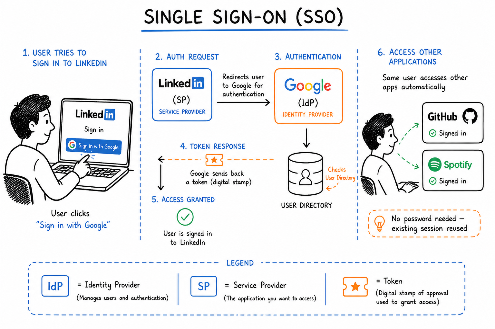

<!-- truncate -->

# How Single Sign On(SSO) Actually Work?

You've done this a hundred times without thinking about it.

You land on a website, maybe LinkedIn, maybe Spotify, maybe some random productivity app and instead of creating yet another account with yet another password, you just click **"Sign in with Google."**

Two seconds later, you're in.

No new password. No verification email. No "must contain one uppercase, one number, and the soul of a forgotten god." Just... in.

That's **Single Sign-On (SSO)** at work. And once you understand how it actually works under the hood, you'll see it everywhere.

## The Master Key Analogy

Think of SSO like a master key for a hotel.

Every room in the hotel has its own lock - the gym, the pool, the restaurant, your room on the 7th floor. Normally, you'd need a separate key for each one. That would be exhausting.

Instead, the front desk gives you one key card when you check in. That single card opens every door you're allowed through, for the entire stay.

SSO works the same way. You prove who you are once. Everything else just opens.

## Two Characters You Need to Know

Before we walk through the login flow, meet the two players involved:

- 1. **Identity Provider (IdP)** - This is the entity that *knows who you are*. Google, Microsoft, Apple - these are common Identity Providers. They hold your credentials and vouch for your identity.

- 2. **Service Provider (SP)** - This is the app or website you're actually trying to use. LinkedIn, GitHub, Notion, Slack - these are Service Providers. They don't store your password. They just trust the Identity Provider's word.

The whole dance of SSO happens between these two.

## How It Actually Works: Step by Step

Let's walk through a real example - logging into LinkedIn using Google.

### Step 1 - You knock on the door

You visit LinkedIn and click **"Sign in with Google."**

LinkedIn (the Service Provider) doesn't ask for your password. Instead, it says: *"I don't know this person. Let me send them to Google."*

### Step 2 - LinkedIn redirects you to Google

LinkedIn sends you over to Google with an authentication request — essentially a note that says: *"Hey Google, can you confirm who this person is?"*

### Step 3 - Google checks if you're already logged in

Google (the Identity Provider) looks for an active session on your browser.

- **If you're already logged into Google** → it skips straight to step 6. No password needed.
- **If you're not logged in** → it asks for your credentials.

### Step 4 - You enter your Google credentials

You type in your Google email and password. This is the *only* place your credentials go. LinkedIn never sees them. Ever.

This is actually one of the biggest security wins of SSO — your password lives in one place, with one trusted provider, instead of being scattered across dozens of apps.

### Step 5 - Google verifies who you are

Google checks your credentials against its own database. If everything matches, it doesn't just let you in — it creates something called an **authentication token** (think of it as a signed, digital stamp of approval).

### Step 6 - Google sends that token back to LinkedIn

Google hands the token to LinkedIn. The token essentially says: *"This person is who they say they are. I, Google, can confirm it."*

LinkedIn trusts Google's word, reads the token, and lets you in — without ever having touched your password.

### Step 7 - The magic of the existing session

Here's where SSO really earns its name.

Later that day, you open GitHub and click "Sign in with Google." GitHub sends the same authentication request to Google. But this time, Google already has an active session from when you logged into LinkedIn.

So instead of asking for your password again, Google just says: *"Yep, I know this person. Here's their token."*

You're in GitHub instantly. No password. No friction.

One login. Many doors.

## The Protocols Behind the Scenes

SSO isn't magic - it runs on a set of agreed-upon rules that tell the Identity Provider and Service Provider how to talk to each other and how to trust each other. These rules are called **protocols**.

The three most common ones you'll hear about:

**SAML (Security Assertion Markup Language)** - the older, enterprise-friendly protocol. You'll find it in corporate SSO setups, think logging into your company's internal tools with your work email.

**OpenID Connect** - the modern, developer-friendly protocol built on top of OAuth. This is what powers most "Sign in with Google" buttons you see on consumer apps today.

**OAuth** - technically an authorization protocol (not authentication), but often used alongside OpenID Connect. It's what handles the "allow this app to access your Google account" permissions screen.

You don't need to memorize the differences right now. Just know that when SSO works smoothly, one of these protocols is doing the heavy lifting in the background.

## Why Does Any of This Matter?

SSO isn't just a convenience feature. It solves real problems:

- 1. **For users:** Fewer passwords to remember means fewer weak passwords, fewer forgotten passwords, and fewer "reset my password" spirals at 11pm.

- 2. **For security teams:** When an employee leaves a company, revoking access to one Identity Provider cuts off access to every connected app instantly — instead of hunting down 30 individual accounts.

- 3. **For developers:** Building an app with SSO means you don't have to manage password storage, reset flows, or authentication security yourself. You offload all of that to a provider like Google or Microsoft that is very, very good at it.

## The One Thing to Remember

If you take nothing else from this:

> **SSO means you prove your identity once, to one trusted provider, and that proof travels with you across every connected app.**

Next time you click "Sign in with Google," you'll know exactly what's happening behind that button — a quiet handshake between two systems, so you don't have to think about it at all.

*Enjoyed this? I write about data engineering, system design, and the concepts that actually matter in tech — without the jargon.*

🔗 [LinkedIn](https://www.linkedin.com/in/aditya-singh-rathore0017/) | [GitHub](https://github.com/Adez017)

<GiscusComments/>